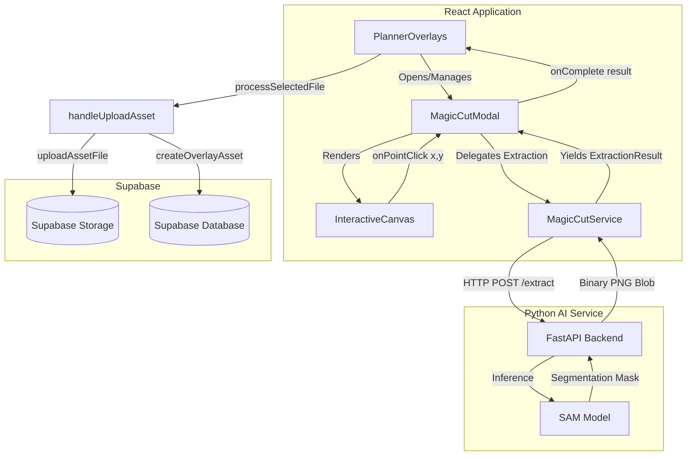

# Magic Cut Pro - Developer Architecture Documentation

This document serves as the comprehensive architectural reference and onboarding guide for the Magic Cut integration within Celebrate.

## 1. Overall Architecture Diagram

## 2. Component Responsibilities

The architecture is built on strict isolation. Each boundary exists to prevent AI infrastructure code from leaking into core Celebrate workflows.

* **`PlannerOverlays` (React Page):** Owns the asset grid, categories, and the native upload pipeline. It renders the Magic Cut button but knows nothing about how extraction works. Boundary existence: Keeps core business logic completely untainted by AI logic.
* **`MagicCutModal` (React Component):** Owns the visual overlay, file selection state, error handling, and orchestrates the extraction flow. It delegates API calls to the service layer. Boundary existence: Ensures all AI-related DOM and React state is instantly destroyed when the modal closes, preventing memory leaks.
* **`InteractiveCanvas` (React Component):** A purely presentational component. Its sole responsibility is drawing the image on an HTML5 `<canvas>`, scaling it, mapping browser clicks to relative image coordinates, and immediately revoking `blob:` URLs. Boundary existence: Isolates complex geometry and canvas memory management from business state.
* **`MagicCutService` (TypeScript API Abstraction):** The only file allowed to communicate with the FastAPI backend. It manages `fetch`, `FormData`, `AbortControllers`, and telemetry. Boundary existence: Protects components from raw HTTP mechanics and acts as a contract translator.
* **`FastAPI Backend` (Python):** Exposes stateless HTTP endpoints (`/status`, `/extract`) for semantic segmentation.
* **`SAM Model` (PyTorch):** The underlying Segment Anything Model executing pixel-level inference.

## 3. Runtime Sequence

The end-to-end data flow operates in a strict, ephemeral lifecycle:

1. **Planner clicks "Extract with AI"**: `PlannerOverlays` mounts `MagicCutModal`.
2. **Image upload**: User selects a local JPEG/WEBP. The modal displays it via `InteractiveCanvas`.
3. **Coordinate selection**: User clicks the object. `InteractiveCanvas` calculates relative `x, y` coordinates.
4. **FastAPI**: `MagicCutModal` invokes `MagicCutService.extract()`, which sends a `multipart/form-data` POST request.
5. **SAM**: FastAPI runs the coordinates through the PyTorch model, generating a semantic mask.
6. **Transparent PNG**: FastAPI crops the bounding box, applies alpha transparency, and returns a binary PNG blob.
7. **File conversion**: `MagicCutService` maps the Blob into a native browser `File` object (`magic_cut_[timestamp].png`).
8. **`processSelectedFile()`**: The Modal passes the File up to `PlannerOverlays`, which instantly unmounts the modal and invokes the native validation funnel.
9. **`handleUploadAsset()`**: The user selects a category and confirms. The identical legacy pipeline takes over.
10. **Supabase**: The file writes to Supabase Storage, and the metadata writes to Postgres.
11. **UI refresh**: The asset grid updates optimistically.

## 4. Environment Configuration

### Frontend
* `VITE_MAGIC_CUT_API_URL`: The absolute URL to the FastAPI backend. If undefined, defaults safely to `http://127.0.0.1:8000/api/v1/magic-cut` for local development.

### Backend (`ai-services/magic-cut`)
* **Startup:** Run via `uvicorn main:app --host 0.0.0.0 --port 8000`.
* **Python Dependencies:** `fastapi`, `uvicorn`, `python-multipart`, `torch`, `torchvision`, `segment-anything`, `opencv-python`, `Pillow`, `numpy`.
* **Model Checkpoint:** The backend requires the pre-trained `sam_vit_b_01ec64.pth` model file to be present in the `checkpoints/` directory.

## 5. Deployment Guide

### Frontend
Deploy the React/Vite application via standard CI/CD (Vercel, Netlify, AWS Amplify). You must inject the `VITE_MAGIC_CUT_API_URL` environment variable pointing to the production Python backend during the build step.

### Backend
1. **Infrastructure:** The FastAPI service requires a persistent compute environment (Render, Railway, AWS ECS, or EC2) with sufficient RAM (minimum 4GB for the base SAM model).
2. **Model Serving:** The checkpoint file must be bundled into the Docker container or mounted via a persistent volume.
3. **CORS:** Ensure `CORSMiddleware` in `main.py` explicitly whitelists the production frontend domain.
4. **HTTPS:** The backend must sit behind an SSL terminator/Load Balancer. Browsers will silently block mixed-content API requests if the frontend is HTTPS but the backend is HTTP.

## 6. Troubleshooting Guide

* **Backend Unavailable (Disabled Button):** Check that the FastAPI server is running. Verify `VITE_MAGIC_CUT_API_URL` exactly matches the running host (including `/api/v1/magic-cut`). Check CORS policies if the request fails purely in the browser.
* **Model Loading (Button Spinning):** The model typically takes 2–10 seconds to load into RAM depending on hardware. The UI will naturally hold in a `starting` state until complete.
* **Timeouts / Aborts:** If an extraction takes longer than the internal timeout, `AbortController` triggers. Consider upgrading the backend compute infrastructure.
* **Large Images:** The frontend rejects images >10MB to protect backend RAM. Shrink the source image.
* **Common Mistakes:** Forgetting to download the `.pth` model checkpoint will cause FastAPI to crash immediately on boot.

## 7. Future Extension Guide

The architecture establishes a strict **Service Abstraction Pattern**. Future AI services (e.g., Lighting AI, Shadow AI, Perspective AI) must adhere to this exact pattern:

1. Create a dedicated backend namespace (`ai-services/shadow-ai/`).
2. Create a dedicated TypeScript service (`src/lib/api/shadowAi.ts`) handling 100% of the `fetch`, validation, and `AbortController` logic.
3. Expose a `/status` endpoint with capability negotiation.
4. Create a dedicated, isolated React Modal (`ShadowAiModal.tsx`).
5. Output standard browser `File` objects.
6. Feed the resulting file back into `processSelectedFile()`.

**Rule of Thumb:** Never allow AI components to touch the database, storage buckets, or global state directly.

## 8. Repository Map

* **`ai-services/magic-cut/main.py`** (MODIFIED) - The hardened, production-ready FastAPI AI backend.
* **`src/lib/api/magicCut.ts`** (NEW) - The strict frontend abstraction layer managing network protocols, timeouts, and file mapping.
* **`src/components/magic-cut/MagicCutModal.tsx`** (NEW) - The ephemeral overlay orchestrating the extraction flow, isolated from global state.
* **`src/components/magic-cut/InteractiveCanvas.tsx`** (NEW) - Pure visual presentation layer handling image rendering and coordinate translation.
* **`src/pages/events/PlannerOverlays.tsx`** (MODIFIED) - The primary dashboard. Modified to extract validation into `processSelectedFile()`, inject the AI button, and mount the modal.

## 9. Final Architecture Summary

The Magic Cut feature behaves structurally as a "programmatic user." It captures user intent, offloads compute-heavy inference to a dedicated microservice, translates the result into a standard browser `File` object, and seamlessly hands it to the identical legacy upload pipeline that has run in production since day one. 

Because of this strict modularity, Magic Cut introduces zero technical debt to the database, zero duplication of storage logic, and guarantees absolute memory safety by destroying all canvas/blob references the moment the modal closes.
